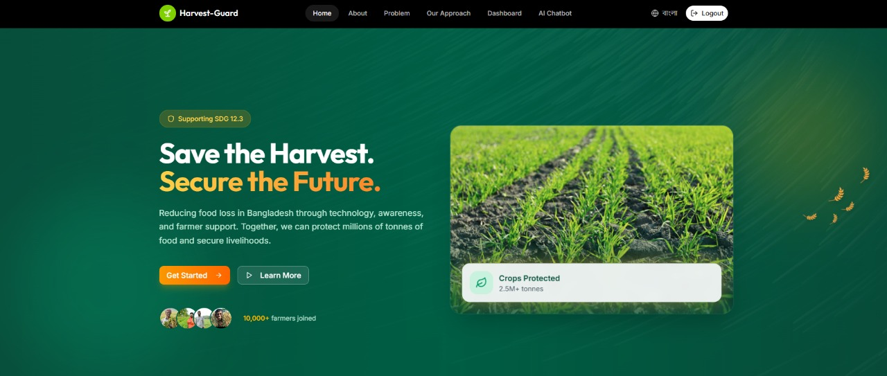
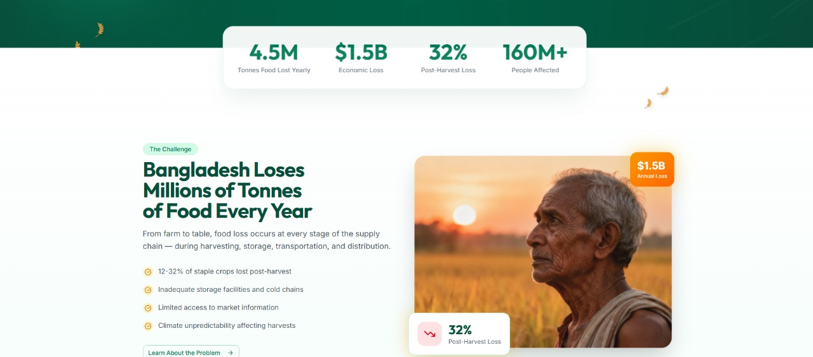
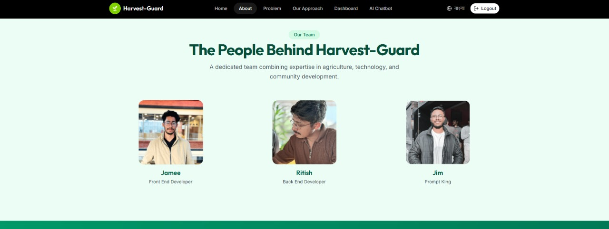
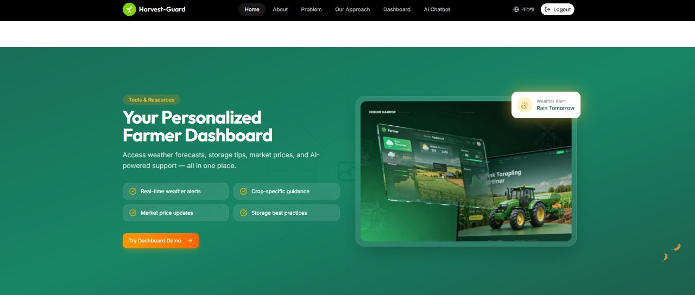
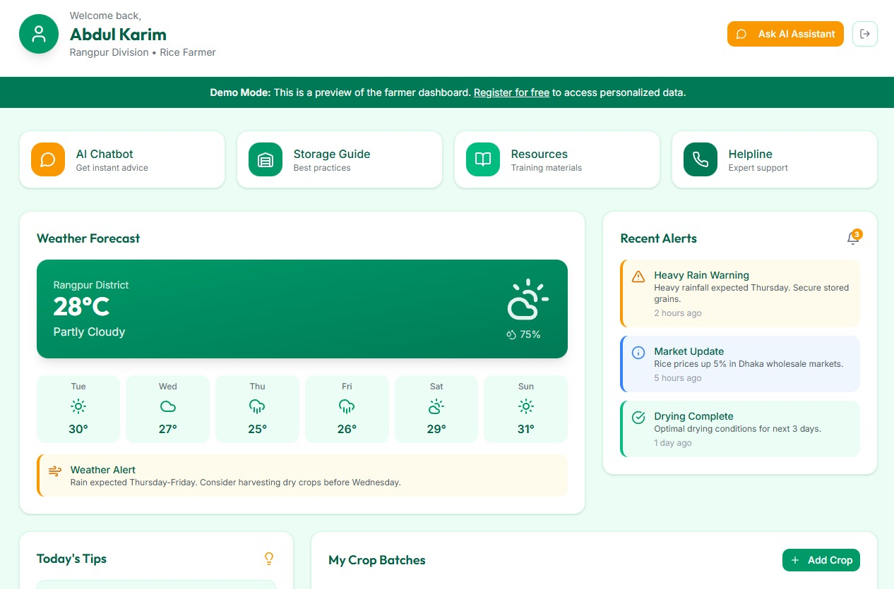
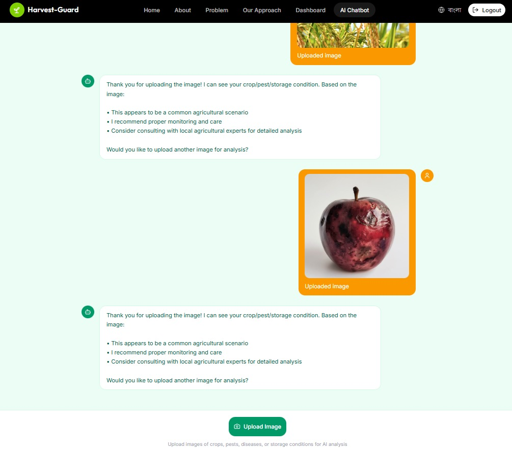

# 🌾 Harvest Guard Bangladesh

**Harvest Guard Bangladesh** is a comprehensive digital platform designed to empower farmers in Bangladesh by reducing post-harvest losses and improving crop management. Our solution combines modern technology with localized agricultural knowledge to ensure food security and economic stability for the farming community.

---

## 🚀 Technologies Used

We have built this project using a robust and modern technology stack to ensure performance, scalability, and a seamless user experience:

-   **Frontend Framework:** [React](https://reactjs.org/) with [Vite](https://vitejs.dev/) for lightning-fast development and build performance.
-   **Styling:** [Tailwind CSS](https://tailwindcss.com/) for a beautiful, responsive, and mobile-first design system.
-   **Authentication & Database:** [Firebase](https://firebase.google.com/) (Auth & Firestore) for secure user management and real-time data storage.
-   **Language Support:** Bilingual support (English & Bengali) to ensure accessibility for all local farmers.
-   **Icons:** [Lucide React](https://lucide.dev/) for clean and consistent iconography.
-   **Deployment:** Optimized for deployment on [Vercel](https://vercel.com/).

---

## 📸 Project Showcase

### 1. Smart Dashboard & Crop Management

The heart of our application is the interactive dashboard. Here, farmers can view real-time weather updates, market prices, and manage their crop batches. The intuitive interface allows for easy tracking of active crops, logging of harvest details, and monitoring of storage conditions, all available in both English and Bengali for maximum accessibility.

### 2. AI-Powered Assistance & Resources

Our integrated AI Chatbot provides instant, personalized advice to farmers. Whether it's identifying a pest, asking about storage techniques, or getting weather-related alerts, the assistant is always ready to help. Coupled with a rich library of educational resources and best practices, we ensure farmers have the knowledge they need right at their fingertips.

### 3. Gamification & Progress Tracking

To encourage best practices and engagement, we've introduced a gamification system. Farmers earn badges like "Risk Mitigated Expert" or "Harvest Master" by successfully managing crops and preventing losses. Detailed statistics and visual graphs help them track their success rates over time, turning farming into a rewarding and data-driven profession.

### 4. Market Insights & Fair Pricing

Access real-time market data to ensure fair pricing for your produce. Stay updated with current trends and demand to maximize your profits and avoid exploitation.

### 5. Weather Forecasting & Alerts

Get precise, localized weather forecasts and severe weather alerts. Plan your farming activities with confidence, knowing when to plant, irrigate, or harvest to avoid weather-related losses.

### 6. Community & Knowledge Hub

Connect with a community of farmers and experts. Share experiences, ask questions, and access a vast library of agricultural knowledge to continuously improve your farming practices.

---

## ✨ Key Features

Harvest Guard Bangladesh is packed with features designed to make agricultural work more efficient and beautiful:

-   **🌱 Crop Batch Tracking:** comprehensive lifecycle management from planting to harvest, including weight estimation and storage location tracking.
-   **📉 Loss Prevention:** Tools to log and analyze loss events (weather, pests, storage) to understand and mitigate future risks.
-   **🌦️ Real-time Weather:** Localized weather forecasts to help farmers plan their activities and avoid weather-related damages.
-   **💰 Market Prices:** Up-to-date market information to help farmers sell their produce at the best possible rates.
-   **🤖 AI Consultant:** A smart chatbot that bridges the gap between expert knowledge and daily farming questions.
-   **🏆 Achievement System:** A motivating badge system that rewards farmers for adopting sustainable and efficient farming practices.
-   **🇧🇩 Bilingual Interface:** Fully localized in Bengali and English, respecting the language preference of our primary users.
-   **📱 Responsive Design:** A mobile-first approach ensuring the app works perfectly on smartphones, tablets, and desktops.
-   **📂 Data Export:** Easy CSV and JSON export options for farmers to keep offline records of their harvest data.
-   **📴 Offline Support:** Critical features work even with spotty internet connections, syncing data once back online.

---

## 🙏 Thank You

Thank you for visiting **Harvest Guard Bangladesh**. We believe that by empowering our farmers with the right tools and information, we can build a more resilient and prosperous agricultural future for Bangladesh. We hope this platform makes a meaningful difference in the lives of those who feed our nation.

---
*Built with ❤️ by Delta HackSquad*
